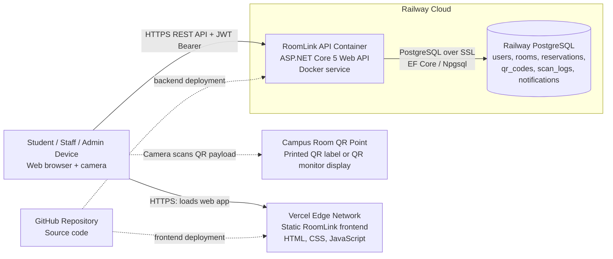

# 3.3 Deployment View

RoomLink is deployed as a cloud-hosted web application. Students, staff, and administrators access the system from a browser on a laptop or mobile device. The browser downloads the static frontend from Vercel over HTTPS and then communicates directly with the RoomLink backend API over HTTPS. Authentication is handled with JWT bearer tokens, so every protected request from the browser to the API includes a token after login.

The backend is deployed on Railway as a Dockerized ASP.NET Core 5 Web API container. This container hosts the authentication, room management, reservation, QR, notification, and background sweep services. It is the only application component that can access the database. The API connects to Railway PostgreSQL using the `DATABASE_URL` environment variable through EF Core and Npgsql, with SSL enabled in production.

The PostgreSQL database stores all persistent system data, including users, rooms, reservations, QR codes, QR scan logs, and notifications. Client devices never connect to PostgreSQL directly; all database operations pass through the backend API. This separation protects the database from direct public access and keeps validation rules centralized in the API layer.

Physically, each reservable university room has a QR point, either as a printed QR label near the room or as a QR monitor display managed by staff/admin users. Students scan the QR code using the browser camera. The scanned QR payload is sent to the backend API, where it is validated against the room, reservation time window, and current reservation status before the system performs check-in, break, or check-out actions.

## Nodes

| Node | Type | Responsibility |
|---|---|---|
| Student / Staff / Admin Device | Client hardware | Runs the browser UI, scans QR codes with the camera, sends HTTPS requests to the API. |
| Campus Room QR Point | Physical room asset | Provides the QR payload used for room check-in, break, and check-out actions. |
| Vercel Edge Network | Frontend hosting | Serves static HTML, CSS, and JavaScript files. |
| Railway API Container | Backend hosting | Runs the ASP.NET Core API, business rules, authentication, QR validation, notifications, and background sweeps. |
| Railway PostgreSQL | Managed database | Stores persistent RoomLink data. |
| GitHub Repository | Source control | Supplies source code for frontend and backend deployment pipelines. |

## Connections

| Source | Target | Connection |
|---|---|---|
| Browser client | Vercel frontend | HTTPS request for static web files. |
| Browser client | Railway API | HTTPS REST API calls secured by JWT bearer authentication. |
| Browser client | Campus room QR point | Camera scan of printed or displayed QR code. |
| Railway API | Railway PostgreSQL | PostgreSQL connection over SSL using EF Core and Npgsql. |
| GitHub | Vercel | Frontend deployment from repository. |
| GitHub | Railway API | Backend deployment from repository using Dockerfile. |
